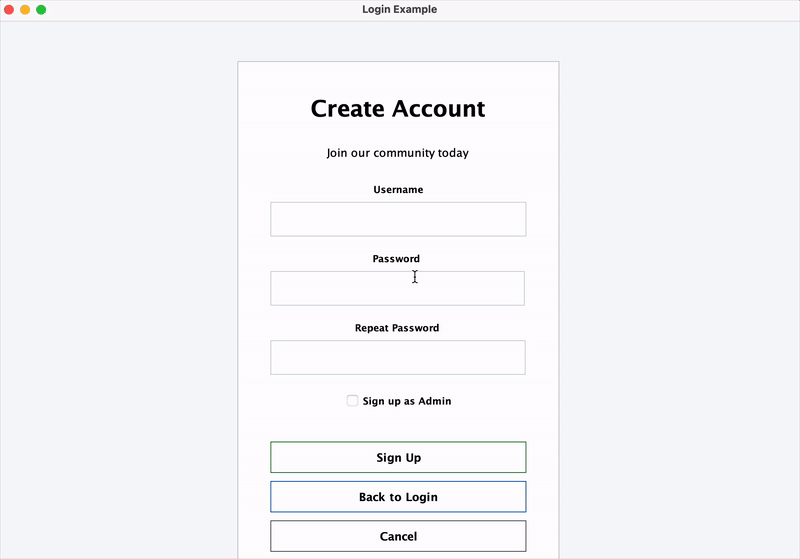
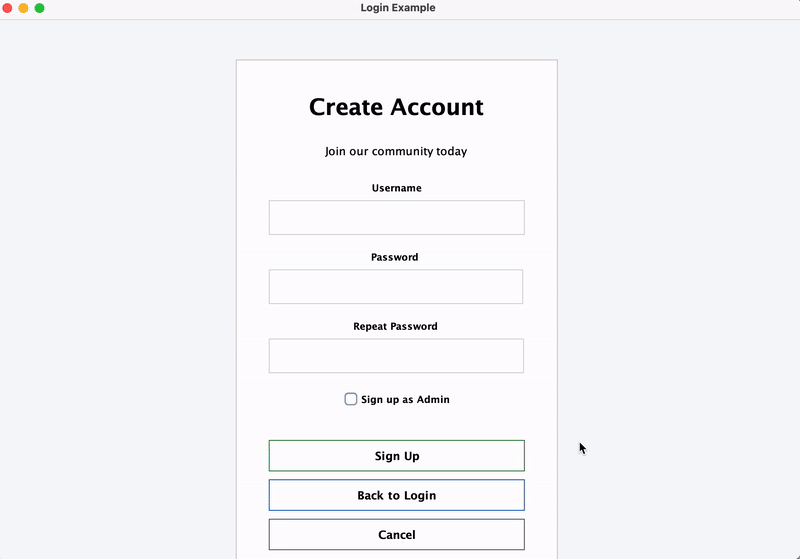

# ** CSC207 Group 8 - MIAO MIAO – Lost & Found System**

## **Authors & Contributors**
- Yipeng Zhao
- Xiaotong Shen
- Ethan Hapurne
- Franz Shi
- Ya-Chun Ho  

---

## **Summary**
**Purpose:**  
This project is a **Lost & Found system** with real-time posting, account management, admin features, fuzzy searching and direct messaging (DM) features, inspired by platforms like Piazza but enhanced with location-based search, tag filtering, and credibility systems.  

**Why it was made:**  
To create a more efficient and community-driven way for people to report, find, and return lost items in a university or public setting.  

**Problem solved:**  
- Centralizes lost & found communication.  
- Reduces time to match lost items with owners.  
- Encourages engagement via a reward and credibility system.  

---

## **Table of Contents**
1. [Features](#features)
2. [Demo](#demo)
3. [Technology Stack](#technology-stack)
4. [Project Structure](#project-structure)
5. [Installation](#installation)
6. [Usage](#usage)
7. [License](#license)
8. [Feedback](#feedback)
9. [Contributing](#contributing)

---

## **Features**
- **Lost & Found Posting:**  
  Post lost or found items with tags (e.g., “wallet”, “airpods”) and general location.
- **Search & Filters:**  
  Search by tag, keyword, location, or time. Includes fuzzy search for typos and related terms.
- **Comment System:**  
  Comment under posts to provide updates or information.
- **Direct Messaging (DM):**  
  Private chat between users to arrange returns.
- **User Blocking:**  
  Block unwanted messages from specific users.
- **Admin Tools:**  
  Delete/edit posts, manage users, handle harassment reports.
- **Data Persistence:**  
  Uses Firebase APIs to store posts, comments, and chat history.

---

## **Demo**

### **Application Overview**
The Lost & Found System provides an intuitive interface for managing lost and found items with real-time communication features.


*Main dashboard showing recent lost and found posts with search functionality*

### **User Authentication**
Secure login and registration system with Firebase authentication.


*User login and registration interface with email and password authentication*

### **Posting Lost & Found Items**
Easy-to-use forms for creating detailed posts about lost or found items.


*Form for creating a new lost or found item post with tags and location*

### **Search & Discovery**
Advanced search functionality with fuzzy matching and filtering options.


*Search page with keyword, tag, and location filters*

### **Direct Messaging**
Private communication system for arranging item returns.


*Real-time chat interface for private communication*

### **Admin Features**
Comprehensive admin panel for managing users and content.


*Admin dashboard showing user management and system statistics*


*Additional features and functionality demonstrations*

---

## **Technology Stack**
- **Backend:** Java 17 with Clean Architecture pattern
- **Build Tool:** Maven
- **Database:** Firebase (Firestore & Authentication)
- **Testing:** JUnit 5 with Mockito
- **Code Coverage:** JaCoCo
- **Architecture:** MVC pattern with Interface Adapters

## **Project Structure**
```
CSC207-Miao-Miao/
├── java/
│   ├── app/                 # Application entry point
│   ├── entity/              # Domain entities (User, Post, Chat)
│   ├── use_case/            # Business logic and use cases
│   ├── interface_adapter/   # Controllers, Presenters, ViewModels
│   ├── data_access/         # Firebase data access layer
│   └── view/                # Swing-based UI components
├── resources/               # Configuration files and Firebase credentials
├── test/java/               # Comprehensive test suite
├── pom.xml                  # Maven configuration and dependencies
└── README.md               # This file
```

**Key Components:**
- **Use Cases:** Core business logic (login, signup, search, etc.)
- **Interface Adapters:** Controllers and presenters for UI interaction
- **Data Access:** Firebase integration for persistence
- **Views:** Swing-based user interface components

---

## **Installation**
### Requirements
- **Java Version:** Java 17 (OpenJDK 17.0.16 or later)
- **Maven:** Version 3.6.0 or later (for dependency management and building)
- **Dependencies:**
    - Firebase Auth REST API (Docs: https://firebase.google.com/docs/reference/rest/auth)
    - Cloud Firestore REST API (Docs: https://firebase.google.com/docs/firestore/use-rest-api)

### Steps
1. **Clone this repository:**
   ```bash
   git clone https://github.com/Ethan-Hapurne/CSC207-Miao-Miao.git
   cd CSC207-Miao-Miao
   ```

2. **Verify Java 17 is installed:**
   ```bash
   java -version
   # Should show Java 17.x.x
   ```
   
   **Note:** This project requires Java 17 specifically. If you have multiple Java versions installed, ensure JAVA_HOME points to Java 17:
   ```bash
   export JAVA_HOME=/path/to/java17
   export PATH=$JAVA_HOME/bin:$PATH
   ```

3. **Build the project:**
   ```bash
   mvn clean compile
   ```

4. **Run tests (optional but recommended):**
   ```bash
   mvn test
   ```

5. **Run the main application:**
   - **Option A - From command line:**
     ```bash
     mvn exec:java -Dexec.mainClass="app.Main"
     ```
   - **Option B - From IDE:**
     - Open the project in your preferred IDE (IntelliJ IDEA, Eclipse, VS Code)
     - Locate `main/java/app/Main.java`
     - Run the `Main` class

---

## **Usage**
1. **Register/Login:** Create an account with email and password.  
2. **Post Lost/Found Item:** Include description, tags, and location.  
3. **Search:** Use keyword, location, or tag filters to find items.  
4. **Comment:** Provide updates or tips under a post.  
5. **Direct Message:** Privately message a user.  
6. **Admin Actions:**  
   - Remove/edit posts.  
   - Block harassing users.  

---

## **License**
This project is licensed under the MIT License - see the LICENSE file for details.

---

## **Feedback**
### How to Provide Feedback
- **GitHub Issues:**  
  Go to the "Issues" tab of this repository and click "New Issue."  
  Clearly describe your suggestion, bug, or question.

### Feedback Guidelines
- Be respectful and constructive.
- For bug reports, include:
    1. Steps to reproduce the issue
    2. Expected result
    3. Actual result
    4. Screenshots (if applicable)
- For feature requests, explain:
    - The problem it solves
    - Why it would be useful

---

## **Contributing**
- Fork the repository.  
- Create a new branch for your feature:
  ```bash
  git checkout -b feature-name
  ```
- Submit a pull request with:
  - A clear description of changes.
  - Screenshots if applicable.
